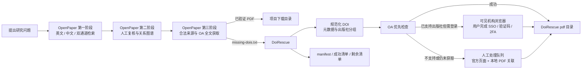

# OpenPaper 文献研究工作台与 DoiRescue 文献补漏器

> Windows x64 封闭内测工具包：先用 OpenPaper 完成“发现—复核—图谱—全文”，再把未自动获取的 DOI 交给 DoiRescue 做 OA、机构访问和人工补漏。

本仓库把两个**相互独立、前后接力**的程序放在同一处说明和发布。它们不是两个重复的下载器，也不要求把源码、账号或研究数据揉进同一个环境。

| 程序 | 它解决什么问题 | 什么时候打开 |
|---|---|---|
| **OpenPaper v0.2.0-internal.2** | 文献发现、人工复核、关系图谱、默认全文获取和项目续作 | 一个研究问题刚开始，或需要继续已有研究项目时 |
| **DoiRescue v0.1.0** | 接收 OpenPaper 未获取的 DOI，继续尝试 OA、已有机构权限及人工 PDF 关联 | OpenPaper 第三阶段仍留下 `*-missing-dois.txt` 时 |
| **instsci-worker.exe** | DoiRescue 随包附带的后台 Provider/出版社适配执行器 | **无需单独打开**；由 DoiRescue 自动调用 |

## 一眼看懂整套流程



核心原则只有一句：**让机器扩大和整理候选，让研究者保留判断权，让每一次选择、缺口与续作都能在本机项目中找回来。**

## 下载与启动

请从本仓库的 **Releases** 下载，不要直接下载仓库源文件。

### 1. OpenPaper

下载：`OpenPaper-v0.2.0-internal.2-Windows-x64-Portable.zip`

1. 将 ZIP 完整解压到普通本地目录。
2. 保留 `OpenPaper.exe` 与 `_internal` 目录的相对位置。
3. 双击 `OpenPaper.exe`。
4. 等待浏览器打开 `http://127.0.0.1:8787/`。
5. 第一次使用建议保持“本地检索”，先完成一个 10–20 篇的小项目。

### 2. DoiRescue

下载：`DoiRescue-v0.1.0-Windows-x64.zip`

1. 将 ZIP 完整解压。
2. 必须保留两个同级目录：`DoiRescue` 和 `instsci-worker`。
3. 双击 `DoiRescue\DoiRescue.exe`。
4. 不要单独移动或双击 `instsci-worker.exe`；它是主程序的后台组件。
5. 拖入 OpenPaper 导出的 `*-missing-dois.txt`，或粘贴含 DOI 的中英文参考文献。

Windows SmartScreen 可能因为内测 EXE 尚未代码签名而提示“未知发布者”。请先核对下载来源及 SHA-256，再决定是否运行。

## OpenPaper：从问题到可续作项目

OpenPaper 不是一次性搜索框，而是一个本地优先的研究工作台。

### 第一阶段：发现文献

- **英文基础检索**：Crossref + OpenAlex，适合先建立可解释、可重复的候选基线。
- **英文深度检索**：可选连接个人 Undermind workspace，用于语义近邻、引文链和研究空白线索。
- **中文检索**：通过可见的知网专用浏览器，由用户自行登录和处理验证码；自动读取失败时可导入 RIS、EndNote、RefWorks 或纯文本题录。
- **双通道**：英文与中文任务独立运行，任一路先完成就先进入复核区，另一条通道随后增量合并且不重置已有选择。

### 第二阶段：人工复核与图谱

- 统一整理不同来源候选，但保留来源差异。
- DOI、知网身份、详情页和题名指纹共同参与身份归一及去重。
- 推荐、相关度和机器翻译只用于导航，不等于正式纳入。
- 关系图谱中的实线表示可核验引用，虚线表示本地语义相关；图谱用于提出复核问题，不直接证明结论。
- 每一次勾选、排除、删除和全文交接都会进入项目快照，之后可以继续。

### 第三阶段：全文与缺失清单

- 优先检查出版社开放版、机构/学科仓储、Unpaywall、Europe PMC、预印本及其他可核验 OA 线索。
- 中文来源只保存当前账号或机构权限允许访问且验证为 PDF 的文件。
- HTML 登录页、CAJ/NH 和错误页不会被当作 PDF 成功。
- 未获取记录会留在项目中，并导出缺失 DOI；“未获取”不等于“文献不存在”。

OpenPaper 的逐步操作、数据目录与排障方法见 [OpenPaper 完整指南](docs/OPENPAPER_GUIDE.md)。

## DoiRescue：OpenPaper 第三阶段之后的补漏流程

DoiRescue 不写回 OpenPaper，也不复制 OpenPaper 的检索、复核、图谱和项目管理。它只处理“全文仍未获得”这一段。

### 第一步：导入和识别

- 拖入 `*-missing-dois.txt`；或粘贴中英文参考文献。
- 提取、规范化、转为小写并去重 DOI。
- 可从 Crossref 补充题名、年份、期刊和语言线索。
- 生成统一的 `https://doi.org/{doi}` 官方解析地址。

### 第二步：建立 Provider 计划

- 按 InstSci 的出版社 profile 推断并分组，例如 Wiley、Elsevier、Springer、Oxford Academic。
- 混合出版社不会再被整体送入一个模糊的 `--publisher auto` 任务。
- 已识别的出版社和 unknown/unsupported 分开处理，并写入 `provider-plan.json`。

### 第三步：OA 优先

- “开始下载”阶段只尝试合法开放来源，不启动机构登录浏览器。
- Unpaywall 邮箱未配置时完全跳过 Unpaywall，不发送空邮箱请求。
- 下载后检查 `%PDF-` 文件头、文件大小和 SHA-256；无效内容进入隔离区。
- 已支持出版社但 OA 未成功的记录进入“需要机构访问”；未知出版社进入“需要人工处理”。

### 第四步：机构访问

- 只处理仍未下载且已识别出版社的记录。
- 每篇任务都显式携带出版社与机构信息，避免后台等待隐藏输入。
- 浏览器可见；SSO、验证码、二维码与 2FA 由用户完成。
- 同一 DoiRescue 专用浏览器 Profile 可复用有效登录会话，但程序不保存或读取明文密码。
- 机构队列固定并发数为 1，支持跳过、重试和停止；关闭浏览器不会让整批永久卡死。

### 第五步：人工处理

- 打开 DOI 官方页面或可信出版社页面。
- 记录人工处理原因，支持上一篇、下一篇、跳过和恢复。
- 手动下载后选择本地 PDF；程序先校验文件，再尽可能比对 DOI 或题名。
- 原文件不会被删除，已有 PDF 不会被覆盖。
- 只有有效 PDF 被程序确认并关联后，记录才会变为 `downloaded`。

DoiRescue 的界面、状态、输出文件和会话复用见 [DoiRescue 完整指南](docs/DOIRESCUE_GUIDE.md)。

## `instsci-worker.exe` 到底是什么

`instsci-worker.exe` 是 DoiRescue 打包时附带的命令行 Worker，包含 InstSci Workflow 0.2.0a2 及其出版社、浏览器和 PDF 处理依赖。主界面会在后台调用它完成：

- DOI 出版社 profile 推断和 provider plan；
- OA-only 检查；
- 按明确出版社执行机构访问；
- 启动或复用 InstSci 专用可见浏览器会话；
- 输出 Provider manifest、诊断信息与 PDF 候选。

它**不是第二个桌面应用**，也不负责显示 DoiRescue 表格。用户通常不应直接运行、重命名或把它从 `instsci-worker` 目录中移走。若它缺失，DoiRescue 仍可解析 DOI 和显示部分界面，但下载与机构 Provider 功能会不可用。

## 两个程序之间如何交接

OpenPaper 与 DoiRescue 当前采用文件交接，而不是互相修改数据库：

```text
OpenPaper 项目
  └─ 第三阶段未获取 DOI
       └─ *-missing-dois.txt
            └─ 拖入 DoiRescue
                 ├─ pdf\
                 ├─ manifest.json
                 ├─ success.csv
                 ├─ still-missing-dois.txt
                 ├─ institution-required-dois.txt
                 ├─ manual-required-dois.txt
                 └─ manual-required-links.html
```

这种“侧车”结构的好处是：

- OpenPaper 保持研究工作台职责，不被多个浏览器 Skill 和下载器依赖拖重。
- DoiRescue 可独立升级、停止或更换 Provider。
- 任何补漏失败都不会破坏 OpenPaper 的项目快照。
- 输出 manifest 保留来源、阶段、失败原因和下一步动作，便于审计与恢复。

设计演变与关键取舍见 [设计决策与项目演进](docs/DESIGN_DECISIONS.md)。

## 数据与隐私边界

### OpenPaper 本地数据

默认目录：`%LOCALAPPDATA%\OpenPaper\data`

其中可能包含项目快照、检索历史、PDF、图谱缓存、知网浏览器 Profile、Undermind 认证状态、日志和个人设置。它们不在本仓库发布包中，也不应直接上传 GitHub。

### DoiRescue 本地数据

- 设置：`%USERPROFILE%\.doi-rescue\settings.json`
- InstSci 配置：`%USERPROFILE%\.instsci\config.json`
- 专用浏览器 Profile：`%LOCALAPPDATA%\DoiRescue\browser-profile`
- 下载批次：用户选择的输出目录下，以时间戳创建独立批次文件夹

DoiRescue 不提供学校密码输入框，不自动提交登录表单，不读取或导出 Cookie。浏览器的密码自动填充应交给 Chrome/Edge 自带密码管理器或 Windows 安全机制。

## 状态不是一个模糊的“成功/失败”

| 状态 | 中文含义 | 建议动作 |
|---|---|---|
| `downloaded` | PDF 已下载并通过基础校验 | 打开 PDF 核对题名和版本 |
| `auth_required` | 已识别出版社，需要已有机构权限 | 使用可见机构浏览器 |
| `manual_required` / `unsupported` | 当前 Provider 暂不支持或需要人工处理 | 打开官方页面或关联本地 PDF |
| `manual_in_progress` | 正在人工处理 | 完成、关联 PDF 或跳过 |
| `manual_completed` | 人工步骤已记录，但还没有有效 PDF | 仍可继续关联 PDF |
| `skipped` | 用户主动跳过 | 需要时从批次恢复并重试 |
| `not_found` | 经过有效查询后确实未找到记录 | 核对 DOI 与元数据 |
| `failed` | 网络、请求或程序错误 | 查看失败阶段后重试 |

`unsupported_publisher` 不应被解释成 `not_found`；关闭浏览器也不等于文献不存在。

## 输出与可审计性

DoiRescue 每个批次会保存：

- `manifest.json`：全部记录、机器状态、Provider 状态、失败阶段、原因和下一步动作；
- `success.csv`：成功 PDF 清单；
- `still-missing-dois.txt`：全部仍未下载 DOI；
- `institution-required-dois.txt`：等待机构访问；
- `manual-required-dois.txt`：等待人工处理；
- `manual-required-links.html/.csv`：可直接打开的官方导航；
- `institution-queue.json`：可恢复的机构任务队列；
- `provider-plan.json`：出版社分组；
- `run.log`：已脱敏运行日志；
- `pdf\` 与 `quarantine\`：有效 PDF 与不合格候选隔离目录。

字段与目录关系见 [架构、数据和安全说明](docs/ARCHITECTURE_AND_SECURITY.md)。

## 当前版本与验证信息

| 项目 | 版本 | 当前发布验证 |
|---|---|---|
| OpenPaper | `0.2.0-internal.2` | 150 项 Python 单元测试通过；前端语法检查通过；最终 ZIP 新鲜解压健康检查通过；安全扫描通过 |
| DoiRescue | `0.1.0` | 54 项测试通过；打包版包含 GUI 与 Worker；压缩包结构及敏感路径检查通过 |
| InstSci Workflow | `0.2.0a2` | 作为 DoiRescue Worker 的固定 Provider，来源提交 `3c3bb4f4da5c73d23b198a791ce1068c5112b92d` |

详细构建来源、SHA-256 和检查方法见 [发布与完整性验证](docs/RELEASE_AND_VERIFICATION.md)。

## 已知限制

- 当前只发布 Windows 10/11 x64 构建，EXE 尚未进行 Authenticode 签名。
- OpenPaper 的知网自动读取受页面结构、验证码和机构登录流程影响；题录导入是正式兜底。
- Undermind、OpenAlex、Unpaywall 及出版社服务均可能受网络、额度和外部服务状态影响。
- DoiRescue 只处理 DOI，不处理 CNKI/万方 ID 或 CAJ。
- 机构访问能力取决于用户真实拥有的学校/图书馆订阅，不保证每篇都能获得全文。
- 交互式机构任务目前固定并发数为 1，以避免共享浏览器 Profile、验证码和下载归属冲突。
- PDF 基础校验不能替代研究者对题名、作者、年份、版本与页码的人工核对。
- DoiRescue 不包含 Sci-Hub；OpenPaper 内测版保留个人兼容回退，但全新安装默认关闭且结果单独标识。

常见问题见 [故障排查](docs/TROUBLESHOOTING.md)。

## 使用与合规说明

本仓库当前是封闭内测发布仓库。使用者应只访问自己有权使用的开放资源、学校/图书馆订阅和个人账户；不得绕过验证码、2FA、访问控制或付费墙。对外分享日志、截图或批次前，请删除邮箱、API Key、Token、Cookie、workspace、本机路径、浏览器 Profile、论文全文和个人研究主题。

OpenPaper 源项目声明使用 MIT License。DoiRescue 随附的 InstSci Workflow 基于 MIT 许可项目并保留第三方署名；本二进制内测仓库本身不额外授予超出各组件原始许可证的权利。

## 文档导航

- [OpenPaper 完整指南](docs/OPENPAPER_GUIDE.md)
- [DoiRescue 完整指南](docs/DOIRESCUE_GUIDE.md)
- [设计决策与项目演进](docs/DESIGN_DECISIONS.md)
- [架构、数据和安全说明](docs/ARCHITECTURE_AND_SECURITY.md)
- [故障排查](docs/TROUBLESHOOTING.md)
- [发布与完整性验证](docs/RELEASE_AND_VERIFICATION.md)
- [本次发布说明](RELEASE_NOTES.md)
- [许可证与第三方声明](THIRD_PARTY_NOTICES.md)

---

如果只记住一个入口：**先运行 OpenPaper；只有在第三阶段仍有 DOI 未获得全文时，再打开 DoiRescue。**
