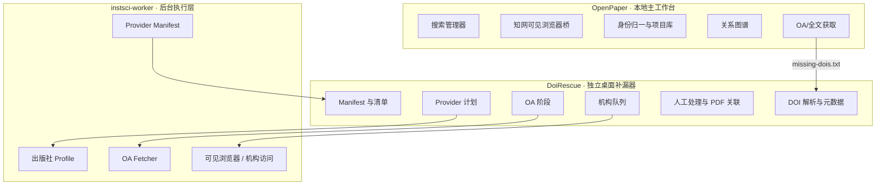

# 架构、数据和安全说明

## 1. 系统边界



OpenPaper 和 DoiRescue 不共享数据库。DoiRescue 不直接修改 OpenPaper 的项目快照或下载目录。

## 2. OpenPaper 主要模块

| 模块 | 作用 |
|---|---|
| `search_manager.py` | 组织 Crossref/OpenAlex 等英文检索 |
| `undermind_direct.py` | OAuth + MCP/HTTPS 直连 Undermind，处理超时、取消和令牌保护 |
| `undermind_bridge.py` | 兼容旧版桥接方式，默认关闭 |
| `cnki_bridge.py` | 中文查询计划、可见浏览器任务和题录导入 |
| `parallel_search.py` | 协调中英文子任务及增量发布 |
| `paper_identity.py` | DOI、CNKI 身份、详情页与题名指纹归一/去重 |
| `metadata_quality.py` | 过滤不可靠作者和元数据，宁缺毋猜 |
| `graph_engine.py` | 引用关系与本地语义相关图谱 |
| `oa_fetch.py` | 受限重定向、公开 HTTPS 校验、PDF 下载与重试 |
| `research_workflow.py` | 三阶段研究流程和全文任务 |
| `project_store.py` | 项目快照、恢复、分组与可恢复删除 |
| `server.py` | 只监听本机的 HTTP API 与页面服务 |
| `app_runtime.py` | 数据目录、设置、发布版运行边界 |

## 3. DoiRescue 主要模块

| 模块 | 作用 |
|---|---|
| `doi_parser.py` | 从 TXT 或参考文献文本提取、规范化和去重 DOI |
| `metadata.py` | Crossref 元数据与语言识别 |
| `provider_worker.py` | Provider 分组计划和 OA-only Worker 命令 |
| `instsci_adapter.py` | 构造明确的 OA/机构命令、读取和映射 Provider manifest |
| `process_control.py` | 精确跟踪并停止当前 Worker 进程树 |
| `pdf_validation.py` | PDF 文件头、大小和 SHA-256 校验 |
| `official_links.py` | DOI 官方链接、可信重定向和回退 |
| `manual_workflow.py` | 人工处理状态、PDF 匹配和安全复制 |
| `browser_session.py` | DoiRescue 专用 Profile 状态、迁移与受限清除 |
| `exporter.py` | 批次 manifest、CSV、TXT、HTML 和目录输出 |
| `settings.py` | InstSci 兼容设置和 DoiRescue 本机设置 |
| `app.py` | PySide6 桌面界面与任务队列 |

## 4. 安装目录与用户数据分离

### OpenPaper

程序目录只包含 EXE、依赖和内测文档。默认用户数据在：

```text
%LOCALAPPDATA%\OpenPaper\data
```

### DoiRescue

程序目录只包含 GUI 与 Worker。设置和浏览器会话在：

```text
%USERPROFILE%\.doi-rescue\settings.json
%USERPROFILE%\.instsci\config.json
%LOCALAPPDATA%\DoiRescue\browser-profile
```

下载结果进入用户选择的输出目录，不写入 EXE 文件夹。

## 5. DoiRescue 批次模型

每次任务创建独立时间戳目录。一个 `PaperRecord` 除 DOI、题名、作者、年份和期刊外，还保存：

- 统一状态与 Provider 原始状态；
- 出版社和下载来源；
- 失败阶段、原因和下一步动作；
- OA 是否检查、机构是否尝试；
- 队列位置、尝试次数、Worker 退出码和部分恢复标记；
- DOI 解析链接、出版社地址与域名；
- 人工处理状态、原因、来源和完成时间；
- PDF 文件路径、大小、SHA-256、校验结果与匹配置信度。

`manifest.json` 是恢复和审计的权威记录；其他 TXT/CSV/HTML 是为特定人工动作生成的派生视图。

## 6. PDF 进入成功区的门槛

自动或人工 PDF 都必须先通过：

1. 文件存在；
2. 大小在允许范围内；
3. 文件头为 `%PDF-`；
4. 计算 SHA-256；
5. 不覆盖已有文件；
6. 人工关联时尽可能核对 DOI 或题名。

不合格候选复制到 `quarantine`，不能计为 `downloaded`。哈希重复文件不会再次复制。

## 7. 官方链接安全规则

每个有效 DOI 都先生成：

```text
https://doi.org/{normalized_doi}
```

解析最终出版社地址时：

- 使用明确超时和有限重定向；
- 只接受 HTTP/HTTPS；
- 排除搜索引擎、localhost、私有网络和明显非官方页面；
- 解析失败仍保留 `doi.org` 链接；
- 不把搜索结果页标记为官方页面；
- 每次人工队列默认只打开一篇。

## 8. 浏览器 Profile 与凭据边界

DoiRescue 可以复用专用浏览器 Profile，以减少同一机构重复登录。但程序：

- 不要求用户把密码交给应用或开发者；
- 不提供明文密码输入框；
- 不读取、导出或打印 Cookie；
- 不自动提交登录表单；
- 不处理验证码、二维码或 2FA；
- 不清除用户日常 Chrome/Edge Profile；
- 只在用户确认后清除 DoiRescue 默认专用 Profile。

浏览器 Profile 本身属于敏感认证数据，应像密码一样保护和备份，不应上传 GitHub。

## 9. 日志脱敏

界面与日志输出不应包含：

- 完整邮箱；
- 密码、验证码、Cookie 或 Token；
- Authorization 请求头；
- 个人 workspace 或浏览器表单内容。

对外反馈前还应人工检查本机用户名、绝对路径、论文全文和个人研究主题。

## 10. 发布包隐私检查

OpenPaper `0.2.0-internal.2` 发布清单记录：

- 无顶层 runtime-data、settings、projects、runs、downloads、graph cache、auth、cnki、data 或 `portable.flag`；
- 无 PDF；
- 无源码根目录或用户 Profile 绝对路径；
- 无本机 OpenAlex Key、Unpaywall 邮箱和 workspace；
- 无 Sci-Hub Cookie 或自定义镜像；
- 新鲜解压后只监听 `127.0.0.1`；
- 新安装 Sci-Hub 兼容设置为关闭。

DoiRescue 发布 ZIP 的路径检查确认没有 browser-profile、runtime-data、Cookie、Login Data、用户 settings/config、下载批次或个人 PDF。

## 11. 威胁与限制

| 风险 | 当前控制 |
|---|---|
| 混合出版社整批误判 | 逐 DOI 推断并分组 |
| 空邮箱请求失败 | 邮箱为空时跳过 Unpaywall |
| 隐藏 CLI 等待输入 | OA/机构命令显式化，无隐藏 institution 输入 |
| 浏览器关闭导致整批卡死 | 单篇队列、超时、存活监测、跳过/停止 |
| 误杀用户浏览器 | 精确 PID 与后代进程树管理 |
| HTML/错误页伪装 PDF | 文件头、大小和 SHA-256 校验 |
| 手动 PDF 对错文献 | DOI/题名匹配置信度与用户确认 |
| 会话数据被上传 | 发布时排除 Profile、Cookie、配置和运行数据 |
| 多窗口互相干扰 | 机构交互并发固定为 1 |

当前 EXE 未代码签名，外部服务和出版社页面也可能随时变化。内测者需要保留原始清单、校验值和人工复核责任。
